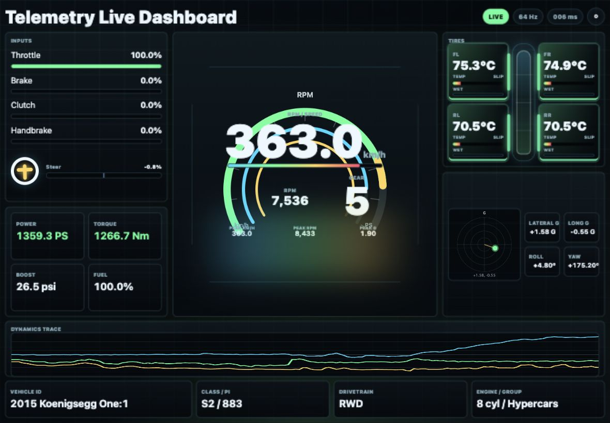

# Forza Horizon 6 Telemetry Live Dashboard

Version 1.0

ESP32-S3をLAN内のWebサーバー兼UDPレシーバーとして動かし、Forza Horizon 6のData Outテレメトリをブラウザでリアルタイム表示するダッシュボードです。ゲーム画面に出にくい車両状態、タイヤ、G、入力、パワー系の情報を、運転中でも読みやすいコックピットUIとして表示します。

ESP32を使う理由は、テレメトリ表示を特定のPCやアプリに閉じ込めず、同じネットワーク上のどのデバイスからでもブラウザで見られるようにするためです。PC、Mac、iPad、タブレット、スマートフォンなど、Webブラウザが使える端末をそのままセカンドスクリーンとして利用できます。

# Forza Horizon 6 Telemetry Dashboard for ESP32-S3

Real-time telemetry dashboard for Forza Horizon 6 using ESP32-S3.

Features:

- UDP Data Out receiver
- LVGL UI
- TFT display
- RPM gauge
- Shift lights
- Tire telemetry
- Wireless telemetry



## Support Policy

This project was developed with OpenAI Codex. The source code is available for personal, educational, hobby, and other non-commercial use, and is provided as-is with no official support. For commercial or monetized use, please contact the copyright holder in advance. Issues, pull requests, forks, and personal modifications are welcome, but responses and maintenance are not guaranteed.

## Features

- ESP32-S3単体でHTTPサーバー、WebSocketサーバー、FH6 UDP受信を実行
- ブラウザだけで閲覧できるリアルタイムダッシュボード
- 60Hzクラスのライブ更新
- メートル法、日本向け単位表示
  - km/h
  - PS
  - Nm
  - ℃
- タイヤ別のTEMP / SLIP / WET表示
- Gレーダー、ピークホールド、短時間ピーク表示
- スロットル、ブレーキ、クラッチ、サイドブレーキ、ステアリング表示
- Drive / Race表示モード
- 8種類のテーマカラー
- 車両ID、クラス、PI、駆動方式、エンジン情報表示
- `/api/telemetry` と `/api/status` によるJSON取得

## Hardware

推奨:

- ESP32-S3
- 4MB以上のFlash
- Wi-Fi接続可能なLAN環境

開発・検証済み環境:

- ESP32-S3-FH4R2
- Arduino ESP32 core
- WebSockets library by Markus Sattler

## Repository Layout

```text
ForzaHorizon6TelemetryESP32/
├── .gitignore
├── ForzaHorizon6TelemetryESP32.ino
├── LICENSE
├── car_data.h
├── assets/
│   └── main-dashboard.png
├── secrets.local.h.example
├── tools/
│   └── fh6_udp_simulator.py
└── README.md
```

`secrets.local.h` はローカル専用ファイルです。Wi-Fi情報を含むため、公開リポジトリには含めないでください。

## Setup

1. Arduino IDEまたはarduino-cliでESP32 coreを導入します。
2. Arduino Library Managerで `WebSockets` をインストールします。
3. `secrets.local.h.example` を `secrets.local.h` にコピーします。
4. `secrets.local.h` にWi-Fi SSIDとパスワードを設定します。
5. スケッチをESP32-S3へ書き込みます。
6. シリアルモニタまたは `/api/status` でESP32のIPアドレスを確認します。
7. FH6側でData Outを設定します。

```text
Data Out: On
Data Out IP Address: ESP32のIPアドレス
Data Out IP Port: 7777
```

8. 同じLAN内のブラウザでESP32へアクセスします。

```text
http://ESP32のIP/
```

## arduino-cli Example

FQBNは使用するESP32-S3ボード定義に合わせて調整してください。

```bash
cd ForzaHorizon6TelemetryESP32
arduino-cli compile --fqbn 'esp32:esp32:esp32s3:CDCOnBoot=cdc' .
arduino-cli upload -p /dev/cu.usbmodem1101 --fqbn 'esp32:esp32:esp32s3:CDCOnBoot=cdc,UploadSpeed=115200' .
```

USB書き込みが不安定な場合は、低速アップロードや全消去後の再書き込みを試してください。

## FH6 Data Out

Forza Horizon 6のData Outは、ゲーム内のフレームレートに近い周期で固定長UDPパケットを送信します。このプロジェクトでは324 bytesのFH6 Data Out packetを受信し、WebSocket経由でブラウザへ配信します。

公式ドキュメント:

- <https://support.forza.net/hc/en-us/articles/51744149102611-Forza-Horizon-6-Data-Out-Documentation>

## Display Precision

運転中の読みやすさと元データの粒度に合わせて、表示桁を分けています。

1桁表示:

- Speed
- Throttle / Brake / Clutch / Handbrake
- Steering input
- Power
- Torque
- Boost
- Fuel
- Tire temperature
- Peak km/h

2桁表示:

- Lateral G / Long G
- Roll / Yaw
- Peak G
- Lap time

RPM、Gear、Car ID、PIなどの整数値は小数なしで表示します。

## Browser UI

右上の設定ボタンから以下を変更できます。

- Display mode
  - Drive
  - Race
- Palette
  - Green
  - Cyan
  - Blue
  - Violet
  - Pink
  - Red
  - Amber
  - Mono

設定はブラウザのlocalStorageに保存されます。

## API

### Dashboard

```text
GET /
```

ブラウザUIを返します。

### Telemetry

```text
GET /api/telemetry
```

最新のテレメトリ値をJSONで返します。

### Status

```text
GET /api/status
```

ESP32側のWi-Fi、UDP、WebSocket、heap状態をJSONで返します。

## Simulator

FH6を起動せずにUI表示を確認したい場合は、同梱のUDPシミュレータを使えます。

```bash
python3 tools/fh6_udp_simulator.py --host ESP32のIP --port 7777 --hz 60
```

## Security Notes

- このダッシュボードはLAN内利用を想定しています。
- 認証機能はありません。
- インターネットへ直接公開しないでください。
- `secrets.local.h` をコミットしないでください。

## Publishing Checklist

GitHubで公開する前に以下を確認してください。

- `secrets.local.h` が含まれていないこと
- ビルド生成物が含まれていないこと
- README内のポート、FQBN、対応ボード情報が最新であること
- 必要に応じてLICENSEファイルを追加すること

## License

Personal, educational, hobby, and other non-commercial use is permitted. For commercial, monetized, sponsored, paid, advertising-supported, client-facing, or revenue-generating use, please contact the copyright holder in advance. See [LICENSE](LICENSE).
